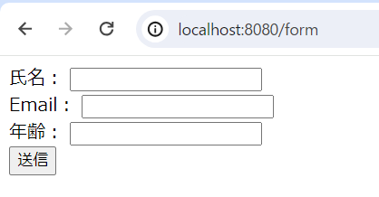
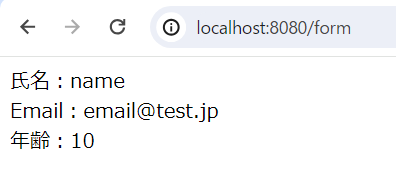
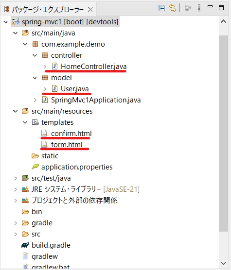
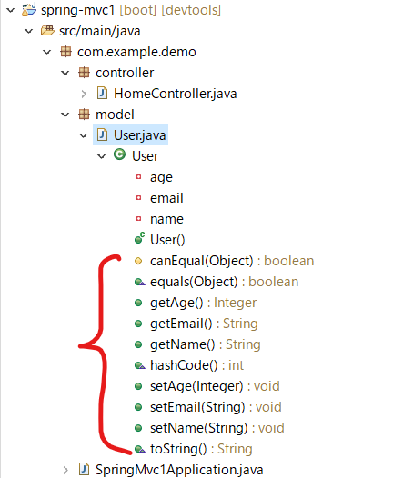

# Java Spring Boot + MVCを触ってみる

仕事の都合上、Javaを勉強する必要が出てきたので急いで勉強。  
最近触っていたVue.jsと重なる部分が少しでもあれば楽だけど。。

## Spring MVC
JavaでWebアプリケーションを開発するためのフレームワーク。  
MVCとは、ソフトウェア設計の一つで、以下の3つの機能が相互に連携して処理を行う。
* Model
* View
* Controller

## サンプルアプリの作成
以下の様なアプリを試作して用語の理解を進める。  
[サンプルアプリ作成時の参考サイト](https://qiita.com/t-shin0hara/items/687085ec34ae78ca2260)

**起動時画面(form.html)**  
「氏名」「Email」「年齢」を入力して「送信」すると値を以下のページに渡して遷移する。  


**送信ボタン押下時画面(confirm.html)**  


**フォルダ構成**  


### モデルの作成(User.java)
Userクラスを定義します。MVCモデルでいうところのモデル(Model)にあたる部分です。

```java
package com.example.demo.model;

import lombok.Data;

@Data
public class User {
	private String name;
	private String email;
	private Integer age;
}
```

Userクラス内には、フィールドの宣言のみ行っていますが、`@Data`アノテーションを使用することで、これらに対するGetter,Setterのメソッドを用意してくれているらしいです。（これは**Lombok**というjavaのライブラリのおかげ）  
[Lombokのことがすぐわかるサイト](https://sight-r.sts-inc.co.jp/tech/java-lombok/)  


### コントローラーの作成(HomeController.java)
HomeControllerクラスを定義します。MVCモデルでいうところのコントローラー(Controller)にあたる部分です。

```java
package com.example.demo.controller;

import org.springframework.stereotype.Controller;
import org.springframework.web.bind.annotation.GetMapping;
import org.springframework.web.bind.annotation.ModelAttribute;
import org.springframework.web.bind.annotation.PostMapping;

import com.example.demo.model.User;

@Controller
public class HomeController {

	@GetMapping("/form")
	private String readFrom(@ModelAttribute User user) {
		return "form";
	}
	
	@PostMapping("/form")
	private String confirm(@ModelAttribute User user) {
		return "confirm";
	}
}
```

**アノテーション一覧**
|アノテーション|役割|
|---|---|
|@Controller|コントローラとして機能させるための記述。 <br> HTTPリクエストを処理してくれるクラスを作成できる。|
|@GetMapping("/form")|引数で指定したpathに対しての**GETリクエスト**を受け付けるための記述。<br> ここではlocalhost:8080/formへリクエストを投げると`readFrom()`関数が走る。|
|@PostMapping("/form")|引数で指定したpathに対しての**POSTリクエスト**を受け付けるための記述。<br> ここではlocalhost:8080/formへリクエストを投げると`confirm()`関数が走る。|
|@ModelAttribute|モデル属性へのバインドを行い、パラメータの参照を簡単に行うための仕組み。 <br> Vue.jsでいうところのマスタッシュ構文に近いイメージ(全然近くないかも)。|

### 起動時画面の作成(form.html)
HTMLファイルを作成します。MVCモデルでいうところのビュー(View)にあたる部分です。  
HTMLの作成は`ThymeLeaf`を使用して作成します。  
これを使用するとWebサーバから受け取った値をテンプレートエンジンに詰め込んで、取得データを簡単に扱えるようにしてくれる。（らしい）  
[Thymeleafを簡単に説明したサイト](https://qiita.com/thirai67/items/64fd18810a8ccfedd459)

```HTML
<!DOCTYPE html>
<html xmlns:th="http://www.thymeleaf.org">
<head>
	<meta charset="UTF-8">
	<title>Title</title>
</head>
<body>
	<form th:action="@{/form}" th:object="${user}" method="post">
		<label for="name">氏名：</label>
		<input type="text" th:field="*{name}"><br>
		
		<label for="name">Email：</label>
		<input type="email" th:field="*{email}"><br>

		<label for="name">年齢：</label>
		<input type="number" th:field="*{age}"><br>
		
		<button>送信</button>
	</form>
</body>
</html>
```

**ThymeLeafの属性一覧**  
[Thymeleafの代表的な属性](https://qiita.com/thirai67/items/64fd18810a8ccfedd459)
|Thymeleafの属性|機能|
|---|---|
|action|フォームの送信先を決定します。 <br> 今回は`"@{/form}"`,`method="post"`の記載があるので、コントローラーで定義した`@PostMapping("/form")`が呼び出されます。|
|object|バインドするオブジェクトを決定します。 <br> 定義済みのモデルを指定するっていう認識でいいのかな。。|
|field|`th:object`で選択したオブジェクトのフィールドを指定します。 <br> `th.object`を使用していない場合、`th:field="${user.age}`のように記載する必要がある。|

### 送信ボタン押下時画面の作成(confirm.html)
HTMLファイルを作成します。MVCモデルでいうところのビュー(View)にあたる部分です。  
起動時画面同様に、HTMLの作成は`ThymeLeaf`を使用して作成します。  

```HTML
<!DOCTYPE html>
<html xmlns:th="http://www.thymeleaf.org">
<head>
<meta charset="UTF-8">
<title>Title</title>
</head>
<body>
	<span th:inline="text">
		氏名：[[${user.name}]]<br>
		Email：[[${user.email}]]<br>
		年齢：[[${user.age}]]<br>
	</span>
</body>
</html>
```

|Thymeleafの属性|機能|
|---|---|
|inline|text属性の記述を省略するための属性。 <br> これを使用すると、th.textを省略する代わりに`[[${param}]]`を使用してパラメータにアクセスが可能。|


### わからん単語
* Spring Web
* Userクラスのフィールド宣言でprivateをつけているのに、クラスの外から値をいじれる理由
* Thymeleaf,テンプレートエンジン
* `th.object`では定義済みのモデルを指定するっていう認識でいいのかな。。

